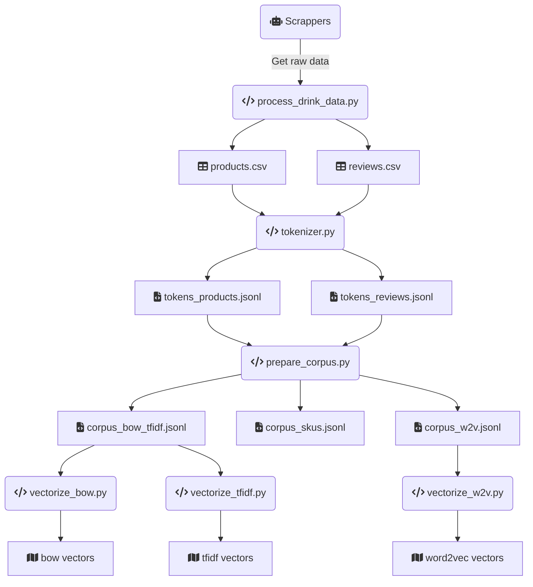

# PLN261-ProcessamentoLinguagemNatural
Repositório do que foi desenvolvido no curso de Processamento de Linguagem Natural

`pip install -r requirements.txt`

`python -m spacy download pt_core_news_lg`

