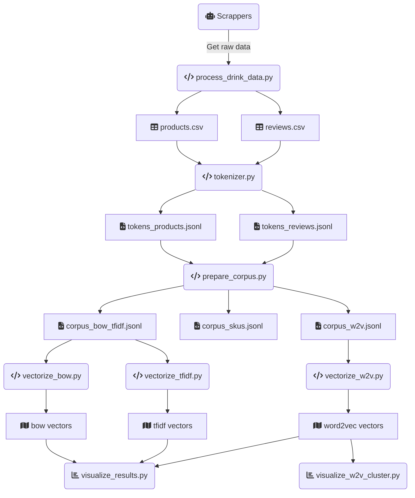

# PLN261-ProcessamentoLinguagemNatural
Repositório do que foi desenvolvido no curso de Processamento de Linguagem Natural

`pip install -r requirements.txt`

`python -m spacy download pt_core_news_lg`

---

- [ ] Adicionar uma gráfico de visualização 3D do modelo gerado pelo Word2Vec
    - [ ] Adicionar um tooltip por item para visualização de características do produto (sku, nome, descrição)
- [ ] Criar um script vectorize_bert.py, utilizando o BERTugues para vetorização dos produtos (verificar se é preciso gerar um corpus específico para este caso)
- [ ] Criar um heatmap do modelo gerado pelo Word2Vec para comparação dos pares de produtos mais similares
- [ ] Analisar se o processo de vetorização está correto, heatmap deveria exibir 1.0 para categorias iguais na diagonal principal
- [x] Reorganizar os arquivos para uma [estrutura padrão de ciência de dados](https://cookiecutter-data-science.drivendata.org/).
